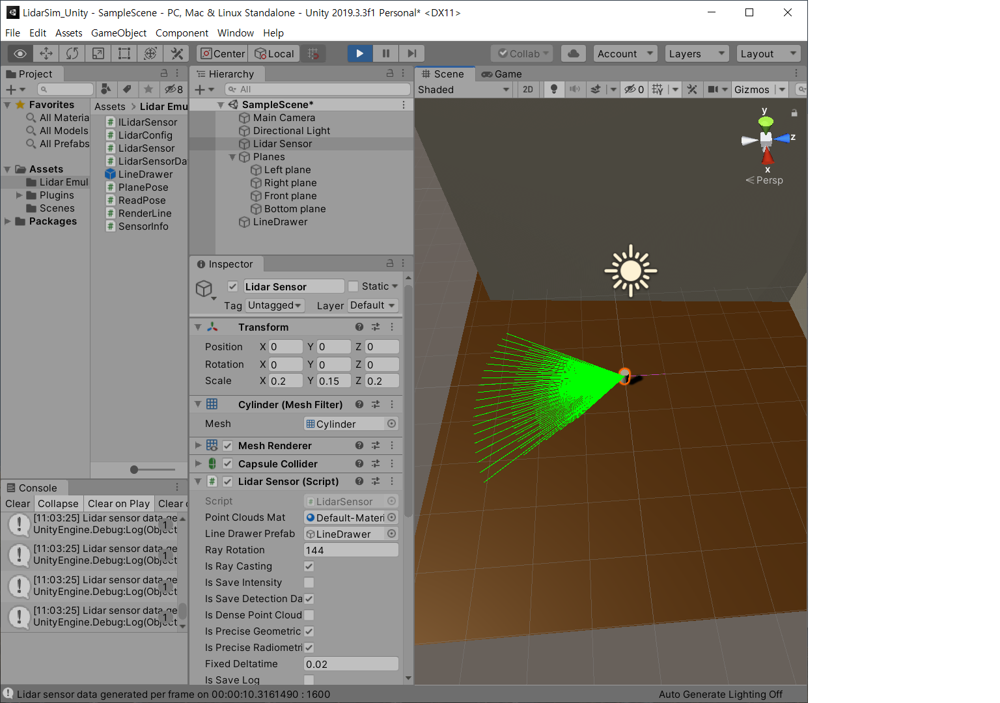

# Velodyne Lidar Simulator(Unity)
Velodyen lidar simulator using multi-threading raycast in Unity.\
Implemented sensor model:
- Geometrical sensor model
  - basic model(baseline)
  - precise model
- Radiometrical sensor model
  - basic model(baseline)
  - precise model

After the generation of simulation data, we evaluate the results by comparing with real lidar data.\

The result of geometric comparison with real lidar data.\

